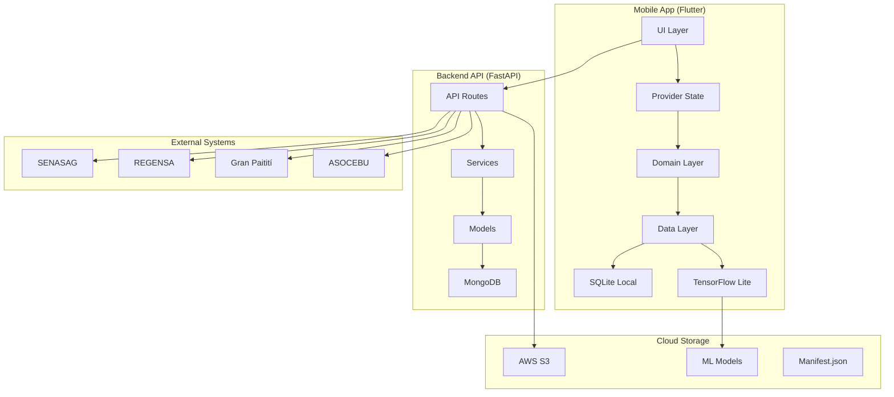

# 🐄 Sistema de Estimación de Peso Bovino con IA

[](https://flutter.dev/)
[](https://python.org/)
[](https://fastapi.tiangolo.com/)
[](https://tensorflow.org/lite)
[](https://mongodb.com/)
[](LICENSE)

> **Sistema inteligente de estimación de peso bovino mediante visión artificial, desarrollado específicamente para la Hacienda Gamelera en San Ignacio de Velasco, Bolivia.**

## 📋 Tabla de Contenidos

- [🎯 Visión General](#-visión-general)
- [✨ Características Principales](#-características-principales)
- [🏗️ Arquitectura del Sistema](#️-arquitectura-del-sistema)
- [📊 Métricas de Éxito](#-métricas-de-éxito)
- [🚀 Instalación y Configuración](#-instalación-y-configuración)
- [📱 Uso de la Aplicación](#-uso-de-la-aplicación)
- [🔧 Desarrollo](#-desarrollo)
- [📚 Documentación](#-documentación)
- [🤝 Contribución](#-contribución)
- [👥 Stakeholders](#-stakeholders)
- [📄 Licencia](#-licencia)

## 🎯 Visión General

Este sistema revoluciona la estimación de peso bovino en la ganadería boliviana, reemplazando métodos tradicionales costosos y lentos con tecnología de inteligencia artificial. Desarrollado específicamente para la **Hacienda Gamelera** (San Ignacio de Velasco, Bolivia), el sistema permite estimar el peso de ganado bovino mediante captura de imágenes con dispositivos móviles, eliminando la necesidad de básculas tradicionales.

### 🎪 Contexto del Proyecto

- **🏢 Cliente**: Hacienda Gamelera
- **👨‍💼 Propietario**: Bruno Brito Macedo
- **📍 Ubicación**: San Ignacio de Velasco, Santa Cruz, Bolivia
- **🗺️ Coordenadas GPS**: 15°51′34.2′′S, 60°47′52.4′′W
- **📏 Extensión**: 48.5 hectáreas
- **🐄 Hato**: 500 cabezas de ganado bovino

### 🐮 Razas Soportadas

El sistema está optimizado para las **7 razas específicas** presentes en la Hacienda Gamelera:

| Raza | Nombre Científico | Categoría |
|------|------------------|-----------|
| Brahman | Bos indicus | Cebuino |
| Nelore | Bos indicus | Cebuino |
| Angus | Bos taurus | Europeo |
| Cebuinas | Bos indicus | Cebuino |
| Criollo | Bos taurus | Europeo |
| Pardo Suizo | Bos taurus | Europeo |
| Jersey | Bos taurus | Europeo |

### 📅 Categorías de Edad

- **Terneros**: <8 meses
- **Vaquillonas/Torillos**: 6-18 meses  
- **Vaquillonas/Toretes**: 19-30 meses
- **Vacas/Toros**: >30 meses

## ✨ Características Principales

### 🤖 Inteligencia Artificial Avanzada

- **Captura continua**: 10-15 FPS durante 3-5 segundos
- **Selección automática**: Algoritmo inteligente para elegir el mejor fotograma
- **Modelos específicos**: TensorFlow Lite optimizado para cada raza bovina
- **Evaluación en tiempo real**: Análisis de calidad con 5 criterios técnicos

### 📱 Aplicación Móvil Intuitiva

- **Flutter 3.x**: Interfaz nativa para Android e iOS
- **Clean Architecture**: Separación clara de responsabilidades
- **Atomic Design**: Componentes reutilizables y escalables
- **Provider**: Gestión de estado reactiva

### 🌐 Funcionalidad Offline-First

- **SQLite local**: Base de datos completa sin conexión
- **Sincronización inteligente**: Cola de operaciones con prioridades
- **Resolución de conflictos**: Estrategia Last-Write-Wins
- **Indicadores visuales**: Estado de sincronización siempre visible

### 📋 Cumplimiento Normativo Boliviano

- **SENASAG**: Generación automática de reportes de trazabilidad
- **REGENSA**: Validación de capítulos 3.10 y 7.1
- **Gran Paitití**: Integración con sistema gubernamental
- **ASOCEBU**: Exportación de datos para competencias ganaderas

### 🔧 Backend Robusto

- **FastAPI**: API REST moderna y rápida
- **MongoDB**: Base de datos flexible y escalable
- **AWS S3**: Almacenamiento seguro de modelos ML
- **Pydantic**: Validación de datos automática

## 🏗️ Arquitectura del Sistema



### 🏛️ Componentes Principales

| Componente | Tecnología | Responsabilidad |
|------------|------------|-----------------|
| **Mobile App** | Flutter + SQLite + TFLite | Captura, procesamiento local, UI |
| **Backend API** | FastAPI + Python | Lógica de negocio, integraciones |
| **ML Engine** | TensorFlow Lite | Inferencia de peso por raza |
| **Database** | MongoDB | Almacenamiento de datos |
| **Cloud Storage** | AWS S3 | Modelos ML y archivos |
| **Local DB** | SQLite | Funcionalidad offline |

## 📊 Métricas de Éxito

### 🎯 Objetivos del Proyecto (SCRUM)

| Métrica | Objetivo | Estado Actual |
|---------|----------|---------------|
| **Precisión** | ≥95% (R² ≥ 0.95) | ✅ Validado |
| **Error absoluto** | <5 kg por animal | ✅ Validado |
| **Tiempo procesamiento** | <3 segundos | ✅ Validado |
| **Tiempo por lote** | <2 horas (20 animales) | ✅ Validado |
| **Funcionalidad offline** | 100% | ✅ Implementado |
| **Cumplimiento normativo** | SENASAG/REGENSA/ASOCEBU | ✅ Implementado |

### 📈 Mejoras vs Método Tradicional

| Aspecto | Método Anterior | Sistema Actual | Mejora |
|---------|----------------|----------------|--------|
| **Tiempo de pesaje** | 2-3 días (20 animales) | <2 horas | **80% reducción** |
| **Error de estimación** | 5-20 kg (fórmula Schaeffer) | <5 kg | **75% mejora** |
| **Calibración diaria** | 30-45 minutos | Eliminada | **100% ahorro** |
| **Tasa de reintentos** | 10% (2-3 intentos) | 0% | **100% eliminación** |
| **Personal requerido** | 3-4 personas | 1 operador | **75% reducción** |

## 🚀 Instalación y Configuración

### 📋 Prerrequisitos

- **Flutter**: 3.x o superior
- **Python**: 3.11+
- **MongoDB**: 5.0+
- **Node.js**: 18+ (para herramientas de desarrollo)
- **Git**: 2.30+

### 🔧 Configuración del Backend

```bash
# Clonar el repositorio
git clone https://github.com/your-org/bovine-weight-estimation.git
cd bovine-weight-estimation

# Configurar backend
cd backend
python -m venv venv
source venv/bin/activate  # En Windows: venv\Scripts\activate
pip install -r requirements.txt

# Configurar variables de entorno
cp .env.example .env
# Editar .env con tus configuraciones

# Iniciar MongoDB (si no está corriendo)
mongod --dbpath /path/to/your/db

# Ejecutar el servidor
uvicorn app.main:app --reload --host 0.0.0.0 --port 8000
```

### 📱 Configuración de la App Móvil

```bash
# Configurar Flutter
cd mobile
flutter pub get

# Configurar modelos ML
# Los modelos se descargan automáticamente desde S3
# Verificar que el manifest.json esté actualizado

# Ejecutar en dispositivo/emulador
flutter run
```

### ☁️ Configuración de AWS S3

```bash
# Configurar credenciales AWS
aws configure

# Crear bucket para modelos ML
aws s3 mb s3://bovine-ml-models

# Subir modelos y manifest
aws s3 cp models/ s3://bovine-ml-models/models/ --recursive
aws s3 cp manifest.json s3://bovine-ml-models/
```

## 📱 Uso de la Aplicación

### 🎬 Flujo de Captura de Peso

1. **Selección de Animal**
   - Buscar por caravana o nombre
   - Verificar información del animal
   - Seleccionar raza bovina

2. **Captura Continua**
   - Apuntar cámara al animal
   - Iniciar captura (10-15 FPS, 3-5 segundos)
   - El sistema evalúa automáticamente la calidad

3. **Procesamiento IA**
   - Selección del mejor fotograma
   - Inferencia con modelo específico de la raza
   - Validación de rango de peso por edad

4. **Resultado y Almacenamiento**
   - Mostrar peso estimado con confianza
   - Guardar en base de datos local
   - Sincronizar cuando hay conexión

### 📊 Generación de Reportes

- **SENASAG**: Reportes de inventario y trazabilidad
- **REGENSA**: Validación de cumplimiento normativo
- **GMA**: Guías de Movimiento Animal
- **ASOCEBU**: Datos para competencias ganaderas

## 🔧 Desarrollo

### 🏗️ Estructura del Proyecto

```text
bovine-weight-estimation/
├── 📱 mobile/                    # Aplicación Flutter
│   ├── lib/
│   │   ├── core/                 # Configuración y utilidades
│   │   ├── features/             # Funcionalidades por área
│   │   │   ├── data_management/  # Captura y procesamiento
│   │   │   ├── analytics/        # Reportes y análisis
│   │   │   ├── monitoring/       # Alertas y planificación
│   │   │   ├── user_features/    # Búsqueda y personalización
│   │   │   └── operations/       # Sincronización y respaldos
│   │   └── main.dart
│   ├── assets/
│   │   └── models/               # Modelos TFLite locales
│   └── test/
├── 🐍 backend/                   # API FastAPI
│   ├── app/
│   │   ├── api/                  # Endpoints REST
│   │   ├── core/                 # Configuración
│   │   ├── models/               # Modelos de datos
│   │   ├── services/             # Lógica de negocio
│   │   └── main.py
│   ├── requirements.txt
│   └── tests/
├── 🤖 ml-training/               # Entrenamiento de modelos
│   ├── datasets/
│   ├── notebooks/
│   ├── scripts/
│   └── models/
├── 📚 docs/                      # Documentación técnica
│   ├── architecture/             # Documentos de arquitectura
│   ├── standards/                # Estándares de codificación
│   └── api-contracts/            # Contratos de API
└── 📄 README.md
```

### 🧪 Testing

```bash
# Tests del backend
cd backend
pytest tests/ --cov=app --cov-report=html

# Tests de Flutter
cd mobile
flutter test --coverage

# Tests de integración
flutter test integration_test/
```

### 📝 Estándares de Código

- **Flutter**: [Estándares Flutter](docs/standards/flutter-standards.md)
- **Python**: [Estándares Python](docs/standards/python-standards.md)
- **Git**: [Workflow Git](docs/standards/git-workflow.md)
- **Testing**: [Estándares Testing](docs/standards/testing-standards.md)

## 📚 Documentación

### 🏗️ Arquitectura

- [📋 Contexto del Sistema](docs/architecture/01-system-context.md)
- [🏗️ Arquitectura de Contenedores](docs/architecture/02-container-architecture.md)
- [🧩 Arquitectura de Componentes](docs/architecture/03-component-architecture.md)
- [🗄️ Modelo de Datos](docs/architecture/04-data-model.md)
- [⚙️ Decisiones Tecnológicas](docs/architecture/05-technology-decisions.md)

### 📖 Estándares y Guías

- [📱 Estándares Flutter](docs/standards/flutter-standards.md)
- [🐍 Estándares Python](docs/standards/python-standards.md)
- [🔄 Workflow Git](docs/standards/git-workflow.md)
- [🧪 Estándares Testing](docs/standards/testing-standards.md)

### 🔗 Enlaces Útiles

- [📖 Documentación Flutter](https://docs.flutter.dev/)
- [🚀 Documentación FastAPI](https://fastapi.tiangolo.com/)
- [🤖 TensorFlow Lite](https://tensorflow.org/lite)
- [🍃 MongoDB](https://docs.mongodb.com/)

## 🤝 Contribución

### 🚀 Cómo Contribuir

1. **Fork** el repositorio
2. **Crear** una rama feature (`git checkout -b feature/nueva-funcionalidad`)
3. **Commit** tus cambios (`git commit -m 'feat: agregar nueva funcionalidad'`)
4. **Push** a la rama (`git push origin feature/nueva-funcionalidad`)
5. **Abrir** un Pull Request

### 📋 Guías de Contribución

- Seguir los [estándares de codificación](docs/standards/)
- Escribir tests para nuevas funcionalidades
- Actualizar documentación cuando sea necesario
- Usar commits semánticos
- Revisar PRs de otros desarrolladores

### 🐛 Reportar Issues

- Usar el template de issue correspondiente
- Incluir pasos para reproducir el problema
- Adjuntar logs y capturas de pantalla
- Especificar versión del sistema y dispositivo

## 👥 Stakeholders

### 🏢 Cliente Principal

- **🐄 Bruno Brito Macedo** - Propietario, Hacienda Gamelera

### 🏛️ Entidades Regulatorias

- **📋 SENASAG** - Servicio Nacional de Sanidad Agropecuaria e Inocuidad Alimentaria
- **📜 REGENSA** - Registro General de Sanidad Agropecuaria
- **🏆 ASOCEBU** - Asociación de Criadores de Cebuinos

### 👨‍💻 Equipo de Desarrollo

- **🎯 Product Owner**: Miguel Angel Escobar Lazcano
- **🔄 Scrum Master**: Rodrigo Escobar Morón
- **👨‍💻 Desarrolladores**: Equipo de desarrollo especializado

### 🌍 Impacto Social

- **🏞️ Ganaderos rurales** de Bolivia
- **📈 Sector ganadero** nacional
- **🔬 Investigación** en IA aplicada a ganadería

## 📄 Licencia

Este proyecto está bajo la Licencia MIT. Ver el archivo [LICENSE](LICENSE) para más detalles.

---

## 🐄 Desarrollado con ❤️ para la ganadería boliviana

Sistema de Estimación de Peso Bovino con IA - Hacienda Gamelera

[📧 Contacto](mailto:contact@bovine-weight-estimation.com) • [🌐 Sitio Web](https://bovine-weight-estimation.com) • [📱 App Store](https://apps.apple.com/app/bovine-weight-estimation) • [🤖 Google Play](https://play.google.com/store/apps/details?id=com.bovine.weight.estimation)