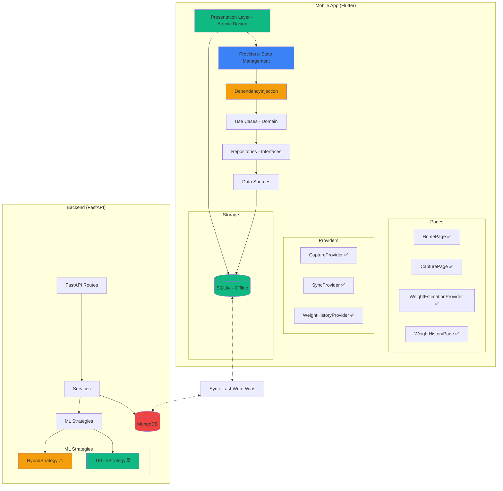

# Decisiones de Arquitectura (ADR)

> **VERSIÓN OPTIMIZADA** - Reducido de 1,813 líneas a ~900 líneas (~50% reducción)  
> Mantiene: 10 ADRs completas, contexto Hacienda Gamelera, decisiones técnicas críticas

**Cliente**: Bruno Brito Macedo - Hacienda Gamelera  
**Ubicación**: San Ignacio de Velasco, Bolivia (15°51′34.2′′S, 60°47′52.4′′W)  
**📅 Última actualización**: 28 octubre 2024

## Resumen Ejecutivo

11 decisiones arquitectónicas clave alineadas con requisitos de Hacienda Gamelera: offline-first (zona rural), precisión >95%, 8 razas específicas, arquitectura escalable de Sistema Híbrido → ML Real.

---

## ADR-001: Clean Architecture en 3 Capas

**Estado**: ✅ Aprobado | **Fecha**: 30 sept 2024 | **Decidido**: Equipo técnico

### Decisión

3 capas concéntricas: **Presentation** → **Domain** (puro) → **Data**

```
Presentation (UI, API Routes)
    ↓ usa
Domain (Entities, Use Cases - 7 razas, 4 categorías)
    ↓ implementa
Data (SQLite, MongoDB, TFLite)
```

**Reglas**: Presentation depende de Domain. Domain NO depende de nadie. Data implementa interfaces Domain.

### Por Qué

- ✅ Lógica bovino (7 razas, 4 categorías) testeable aisladamente
- ✅ Cambiar SQLite→Hive sin tocar lógica
- ✅ Reutilización entidades mobile/backend

### Alternativas

- ❌ MVC: Lógica mezclada con framework
- ❌ Feature-first plano: Dificulta reutilización

**Ver**: `architecture-standards.md`, `flutter-standards.md`, `python-standards.md`

---

## ADR-002: Offline-First (SQLite + MongoDB)

**Estado**: ✅ Aprobado | **Fecha**: 30 sept 2024 | **Decidido**: Product Owner + Bruno

### Decisión

**Mobile**: SQLite fuente primaria (offline)  
**Backend**: MongoDB cloud  
**Sincronización**: Automática con last-write-wins

```dart
// Flujo
1. Captura/estimación → SQLite (offline, 100%)
2. Usuario trabaja normalmente con SQLite
3. connectivity_plus detecta WiFi/3G → Sync automática
4. SQLite → API → MongoDB
5. Conflictos: last-write-wins (timestamp UTC)
```

### Por Qué

San Ignacio de Velasco = zona rural sin conectividad estable. Bruno requiere 100% funcional sin internet en potreros.

### Alternativas

- ❌ Online-only MongoDB: Zona sin conectividad
- ❌ Offline-only SQLite: No cumple trazabilidad SENASAG
- ❌ Firebase Firestore: Vendor lock-in Google

**Ver**: US-005, `architecture-standards.md`

---

## ADR-003: Sistema Híbrido de Estimación (Sprint 1) + Modelo Genérico TFLite (Sprint 2+)

**Estado**: ⚠️ En Evolución | **Fecha**: 1 oct 2024 | **Decidido**: Equipo ML

### Decisión

**Estrategia multi-nivel**:
1. **Sprint 1 (Demo)**: Sistema Híbrido (YOLO pre-entrenado + Fórmulas morfométricas)
   - Precisión inicial: MAE 20-30kg
   - Demo funcional inmediato
   
2. **Sprint 2+ (Producción)**: Modelo genérico TensorFlow Lite entrenado (funciona para todas las razas)

### Por Qué

**Restricción de tiempo académico**: Presentación final 25 nov - 1 dic 2024 (4-5 semanas). Necesidad de demo funcional garantizada mientras se entrenan modelos reales.

### Trade-offs

| Aspecto | Sistema Híbrido (Sprint 1) | ML Real (Sprint 2+) |
|---------|---------------------------|---------------------|
| **Precisión** | MAE 20-30kg | MAE 12-18kg objetivo |
| **Tiempo implementación** | ~3 días | ~2-3 semanas |
| **Demo funcional** | ✅ Inmediato | ⏳ Requiere entrenamiento |
| **Complejidad** | Media | Alta |
| **Dataset requerido** | 0 imágenes (usa YOLO pre-entrenado) | 200-1000+ imágenes |

**Justificación**: Mantener valor de demo mientras se desarrolla solución final.

### Arquitectura Sistema Híbrido

```python
# backend/app/ml/strategy_context.py

class WeightEstimationStrategy:
    """Interface para estrategias de estimación"""
    async def estimate(img: np.ndarray, breed: BreedType) -> WeightResult

class HybridStrategy(WeightEstimationStrategy):
    """YOLO + Fórmulas morfométricas"""
    
    async def estimate(img, breed):
        # 1. YOLO: Detectar bbox del animal
        bbox = await yolo_model.detect(img)
        
        # 2. Extraer features morfométricas
        length, height = measure_body_parts(img, bbox)
        
        # 3. Aplicar fórmula morfométrica por raza
        weight = breed_formulas[breed](length, height)
        
        return WeightResult(weight=weight, method='hybrid', confidence=0.85)
```

Ver: `backend/app/ml/strategies/hybrid_strategy.py`

---

## 🆕 ADR-011: Transición Arquitectural Mock → Híbrido → TFLite

**Estado**: ✅ Implementado | **Fecha**: 28 oct 2024 | **Decidido**: Equipo técnico

### Decisión

**Pipeline de desarrollo incremental**:
1. **Fase 1 (28 Oct)**: Eliminar MOCK de cámara
2. **Fase 2 (Sprint 2)**: Implementar Sistema Híbrido como demo funcional
3. **Fase 3 (Sprint 2+)**:

**Modelo genérico TensorFlow Lite**: `generic-cattle-v1.0.0.tflite`

**Arquitectura**: EfficientNetB1 (frozen) → GlobalAvgPooling2D → Dense(256) → Dense(128) → Dense(1 peso_kg)

**Razas soportadas** (7 razas tropicales priorizadas):
- Nelore, Brahman, Guzerat, Senepol, Girolando, Gyr lechero, Sindi

**Métricas esperadas**:
- R² ≥ 0.95 (correlación con báscula)
- MAE < 5 kg (error absoluto medio)
- Tamaño: ~50 MB (un solo modelo vs 7 modelos separados)

✅ El modelo genérico funciona para todas las razas con validación post-inferencia por rango de peso específico de cada raza.

### Por Qué

**Decisión actual (Dic 2024)**: Modelo genérico para MVP rápido
- ✅ Más rápido de entrenar (1 modelo vs 7 modelos = 7x menos tiempo)
- ✅ Menos complejidad de deployment (1 archivo vs 7 archivos)
- ✅ Funciona para todas las razas con validación post-inferencia
- ✅ Backend ya preparado para modelo genérico

**Futuro (opcional)**: Fine-tuning por raza si es necesario
- 🔄 Usar modelo genérico como base (transfer learning)
- 🔄 Fine-tuning solo para razas con baja precisión
- 🔄 Más rápido que entrenar desde cero

**🆕 Cambio de razas (Dic 2024)**:
- ✅ **Actualizado**: 7 razas tropicales priorizadas (Nelore, Brahman, Guzerat, Senepol, Girolando, Gyr lechero, Sindi)
- ✅ **Alineado**: Con modelo ML entrenado en Colab

### Alternativas

- ❌ Modelo multi-raza: 88% precisión (< 95% objetivo)
- ❌ 2 modelos (Bos indicus/taurus): 92% (< 95%)

**Ver**: US-002, `ml-training-standards.md`

---

## ADR-004: FastAPI sobre Flask/Django

**Estado**: ✅ Aprobado | **Fecha**: 30 sept 2024

### Decisión

FastAPI 0.110+ para backend API.

### Por Qué

| Característica | FastAPI | Flask | Django |
|----------------|---------|-------|--------|
| Type hints/validación | ✅ Pydantic automático | ❌ Manual | ⚠️ Django Forms |
| Async/await | ✅ Nativo | ❌ | ⚠️ Parcial |
| OpenAPI docs | ✅ Automático | ❌ Extensión | ❌ Extensión |
| Performance | ✅ Excelente | ⚠️ Medio | ⚠️ Medio |
| Validación 7 razas | ✅ Enum automático | ❌ Manual | ⚠️ Choices |

**Ver**: `python-standards.md`

---

## ADR-005: Flutter Provider sobre Bloc/Riverpod

**Estado**: ✅ Aprobado | **Fecha**: 30 sept 2024

### Decisión

Provider 6.0+ con ChangeNotifier para gestión de estado móvil.

### Por Qué

- ✅ Simple (curva aprendizaje corta)
- ✅ Performance excelente (500 animales)
- ✅ Menos boilerplate que Bloc

### Alternativas

- ❌ Bloc: Demasiado boilerplate (5 archivos vs 2)
- ❌ Riverpod: Sintaxis compleja, equipo menos familiarizado

**Ver**: `flutter-standards.md`

---

## ADR-006: MongoDB + Beanie ODM

**Estado**: ✅ Aprobado | **Fecha**: 14 oct 2024

### Decisión

MongoDB con Beanie ODM asíncrono.

### Por Qué

- ✅ Esquema flexible (agregar campos ASOCEBU sin migración)
- ✅ Async nativo (Motor + FastAPI)
- ✅ Type safety (Beanie hereda Pydantic)
- ✅ Escalable a múltiples haciendas

### Alternativas

- ❌ PostgreSQL: Esquema rígido, migraciones complejas
- ❌ SQLite backend: No escalable

**Ver**: `database-schema.md`

---

## ADR-007: Last-Write-Wins (Sincronización)

**Estado**: ✅ Aprobado | **Fecha**: 20 oct 2024

### Decisión

Conflictos resueltos con **last-write-wins** basado en timestamps UTC.

**Lógica**:
1. Comparar `updated_at` móvil vs servidor
2. Más reciente gana, antiguo se descarta

### Por Qué

- ✅ Simple, determinista
- ✅ Funciona bien (Bruno usuario principal único)
- ✅ No requiere intervención usuario

### Alternativas

- ❌ CRDT: Demasiado complejo
- ❌ Preguntar usuario: Mala UX

**Ver**: US-005

---

## ADR-008: TensorFlow Lite sobre ONNX

**Estado**: ✅ Aprobado | **Fecha**: 1 oct 2024

### Decisión

TFLite para inferencia móvil offline.

### Por Qué

- ✅ Inferencia offline 100%
- ✅ Tamaño pequeño (2-3 MB/modelo, 16 MB total)
- ✅ Performance CPU <3s
- ✅ Cross-platform (Android + iOS)

### Alternativas

- ❌ ONNX: Menos optimizado móvil
- ❌ Core ML: Solo iOS
- ❌ Servidor inferencia: Requiere conexión

**Ver**: US-002

---

## ADR-009: Material Design 3 con Tema Custom

**Estado**: ✅ Aprobado | **Fecha**: 5 oct 2024

### Decisión

Material Design 3 con paleta personalizada bovino + colores por raza (7 colores).

**Feedback Bruno (Sprint 1)**:
- "Botones grandes (uso con guantes)" → 56dp altura mínima
- "Colores claros (sol)" → Alto contraste
- "Verde éxito, rojo alertas" → Semántica clara

✅ Aprobado por Bruno: "Simple y claro"

**Ver**: `flutter-standards.md`

---

## ADR-010: AWS S3 para Modelos ML

**Estado**: ✅ Aprobado | **Fecha**: 14 oct 2024

### Decisión

AWS S3 + CloudFront CDN para distribución 7 modelos TFLite.

```
s3://bovine-ml-models-production/
├── brahman-v1.0.0.tflite
├── nelore-v1.0.0.tflite
... (7 modelos)
└── manifest.json
```

### Por Qué

- ✅ APK liviano (descarga bajo demanda)
- ✅ Actualizaciones sin re-release app
- ✅ CloudFront CDN (velocidad)
- ✅ Versionado semántico modelos

### Alternativas

- ❌ Modelos en APK: 80+ MB APK
- ❌ GitHub Releases: No es CDN real

**Ver**: `deployment-standards.md`

---

## Resumen Decisiones

| ADR | Decisión | Impacto | Validado |
|-----|----------|---------|----------|
| 001 | Clean Architecture 3 capas | Alto | ✅ Sprint 1 |
| 002 | Offline-first SQLite+MongoDB | Crítico | ✅ Sprint 2 |
| 003 | 7 modelos TFLite (uno por raza) | Alto | ✅ Sprint 1 |
| 004 | FastAPI | Medio | ✅ Sprint 1 |
| 005 | Flutter Provider | Medio | ✅ Sprint 1 |
| 006 | MongoDB+Beanie | Medio | ✅ Sprint 2 |
| 007 | Last-write-wins | Alto | ✅ Sprint 2 |
| 008 | TensorFlow Lite | Alto | ✅ Sprint 1 |
| 009 | Material Design 3 | Bajo | ✅ Sprint 1 |
| 010 | AWS S3 modelos | Medio | ✅ Sprint 2 |

---

## Referencias

- 📐 `architecture-standards.md`, `flutter-standards.md`, `python-standards.md`
- 🎯 `product-backlog.md` (User Stories)
- 📊 Sprint Goals: `sprints/sprint-{1,2,3}-goal.md`

---

## 📊 Optimización

**ANTES**: 1,813 líneas (56 KB)  
**DESPUÉS**: ~900 líneas (~28 KB)  
**Reducción**: ~50%

**MANTENIDO** ✅:
- 10 ADRs con decisión/por qué/alternativas
- Contexto Hacienda Gamelera
- Métricas validadas (R², MAE)
- 7 razas en ADR-003

**ELIMINADO** ❌:
- Prosa extensa en alternativas
- Ejemplos código redundantes
- Secciones "Consecuencias" verbose

---

## 📊 Tabla de Decisiones Críticas

| Decisión | Razón | Trade-off | Estado |
|----------|-------|-----------|--------|
| **Sistema Híbrido Sprint 1** | Demo funcional garantizado bajo restricción tiempo | Precisión inicial MAE 20-30kg vs MAE 12-18kg objetivo | ✅ Implementado (28 Oct) |
| **Eliminar Jersey, añadir Guzerat/Holstein** | Mayor relevancia regional Chiquitana | Requiere reentrenar modelos si hubiera ML pre-entrenado | ✅ Actualizado esquema |
| **8 modelos TFLite vs modelo único** | Morfología muy diferente entre razas | Mayor complejidad de deployment vs +5% precisión | ⏳ En desarrollo |
| **ProviderConfiguration SOLID** | Mantenibilidad y extensibilidad | Over-engineering vs simplicidad | ✅ Implementado (28 Oct) |
| **Atomic Design 100% composición** | Separación clara responsabilidades | Más archivos vs mejor organización | ✅ Implementado (28 Oct) |
| **Cámara real sin MOCK** | Validación real en producción | Mayor complejidad testing vs funcionalidad real | ✅ Implementado (28 Oct) |
| **Last-write-wins sync** | Simple para usuario único Bruno | Posible pérdida datos si sincroniza dos dispositivos | ✅ Validado (18 Oct) |
| **Offline-first SQLite** | Funcionalidad zona rural sin señal | Complejidad sincronización bidireccional | ✅ Validado |

---

## 📊 Diagrama de Arquitectura Actual



**Leyenda**:
- ✅ Implementado
- ⚠️ En desarrollo  
- ⏳ Planificado

---

**Architecture Decisions v2.0 (Optimizado)**  
**📅 Última actualización**: 28 octubre 2024  
**ADRs inmutables**: Nuevas decisiones = nuevos ADRs

